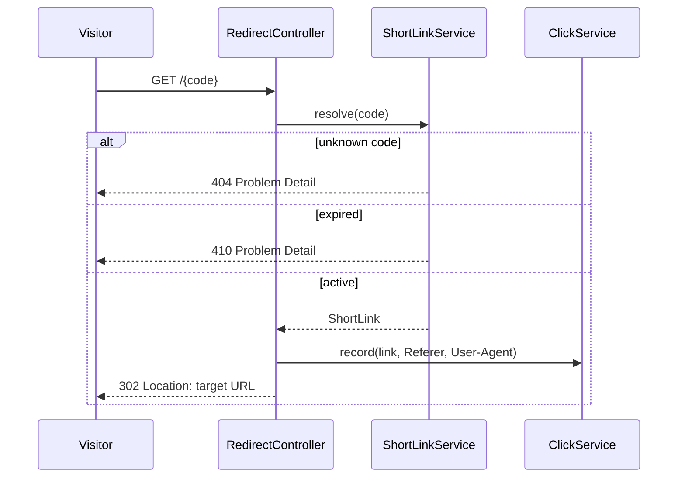
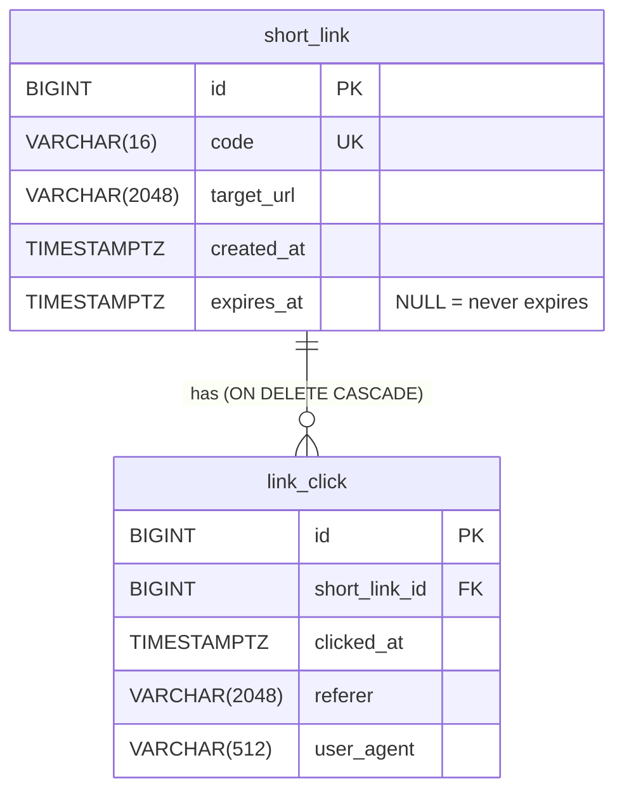

# SimpleURL

[](https://github.com/brunogutierre/SimpleURL/actions/workflows/ci.yml)


[](LICENSE)

A simple URL shortener REST API built with Java 25 and Spring Boot 4: short links, `302` redirects,
optional expiration and click statistics.

## Goals

- Provide a small, well-structured backend that shortens URLs, redirects visitors and tracks clicks.
- Showcase a simple, modern and explicit Spring Boot architecture with high test coverage (≥ 80%, enforced in CI).
- Keep the persistence layer database-ready: JPA entities map the real tables, while the runtime uses
  in-memory repositories (no database required to run the app).

## Features

- Create a short link for any `http`/`https` URL, optionally with an expiration time.
- Redirect `/{code}` to the original URL (`302 Found`); expired links answer `410 Gone`.
- Get and delete links (deleting a link also deletes its clicks).
- Click statistics: total clicks, last click and clicks per UTC day.
- Errors follow [RFC 9457 Problem Details](https://www.rfc-editor.org/rfc/rfc9457).
- Interactive API documentation with Swagger UI.

## Tech stack

| Concern | Choice |
|---|---|
| Language | Java 25 |
| Framework | Spring Boot 4.1 (Spring MVC, Bean Validation) |
| Build | Maven (wrapper included) |
| Persistence model | Jakarta Persistence (JPA) annotations, in-memory repositories |
| API docs | springdoc-openapi 3 (Swagger UI) |
| Tests | JUnit 5, AssertJ, Mockito, Spring Boot Test (`MockMvcTester`), JaCoCo |
| CI | GitHub Actions (build, tests, coverage gate) |

## Quick start

Requirements: JDK 25.

```sh
./mvnw spring-boot:run   # starts the API on http://localhost:8080
./mvnw verify            # runs all tests and the 80% line coverage gate
```

- Swagger UI: http://localhost:8080/swagger-ui.html
- OpenAPI document: http://localhost:8080/v3/api-docs
- Coverage report (after `verify`): `target/site/jacoco/index.html`

### Configuration

| Property | Environment variable | Default | Description |
|---|---|---|---|
| `simpleurl.base-url` | `SIMPLEURL_BASE_URL` | `http://localhost:8080` | Public address used to build `shortUrl` |
| `server.port` | `SERVER_PORT` | `8080` | HTTP port |

## API

| Method | Path | Description | Responses |
|---|---|---|---|
| `POST` | `/api/links` | Shorten a URL. Body: `{"url": "https://...", "expiresAt": "2030-01-01T00:00:00Z"}` (`expiresAt` optional) | `201` + `Location`, `400` |
| `GET` | `/api/links/{code}` | Get a short link | `200`, `404` |
| `DELETE` | `/api/links/{code}` | Delete a short link and its clicks | `204`, `404` |
| `GET` | `/api/links/{code}/stats` | Click statistics: total, last click, clicks per UTC day | `200`, `404` |
| `GET` | `/{code}` | Redirect to the target URL | `302`, `404`, `410` (expired) |

### Examples

```sh
curl -X POST localhost:8080/api/links -H 'Content-Type: application/json' \
     -d '{"url":"https://example.com/docs"}'
# {"code":"9YC4ai6","shortUrl":"http://localhost:8080/9YC4ai6",
#  "targetUrl":"https://example.com/docs","createdAt":"2026-09-24T15:38:04Z","expiresAt":null}

curl -i localhost:8080/9YC4ai6
# HTTP/1.1 302
# Location: https://example.com/docs

curl localhost:8080/api/links/9YC4ai6/stats
# {"code":"9YC4ai6","totalClicks":1,"lastClickAt":"2026-09-24T15:40:12Z",
#  "clicksPerDay":[{"date":"2026-09-24","clicks":1}]}
```

Errors use `application/problem+json`; validation errors list the invalid fields:

```sh
curl -X POST localhost:8080/api/links -H 'Content-Type: application/json' -d '{"url":"ftp://x"}'
# {"title":"Bad Request","status":400,"detail":"Request validation failed",
#  "errors":{"url":"must be a valid http or https URL"},"instance":"/api/links"}
```

## Architecture

Package-by-feature: each feature owns its entity, repository, service and controller. Dependencies
flow one way, `redirect → click → link`; `config` and `error` are cross-cutting.

```
io.github.brunogutierre.simpleurl
├── config/    clock, application properties, OpenAPI metadata
├── error/     global error handling (Problem Details)
├── link/      ShortLink entity, repository, code generation, service, REST API
├── click/     Click entity, repository, statistics service, REST API
└── redirect/  public redirect endpoint
```

```mermaid
flowchart LR
    Client -->|/api/links| ShortLinkController
    Client -->|/api/links/code/stats| StatsController
    Visitor -->|/code| RedirectController

    subgraph link
        ShortLinkController --> ShortLinkService
        ShortLinkService --> ShortLinkRepository
        ShortLinkService --> CodeGenerator
    end
    subgraph click
        StatsController --> ClickService
        ClickService --> ClickRepository
    end
    subgraph redirect
        RedirectController
    end

    RedirectController -->|resolve| ShortLinkService
    RedirectController -->|record| ClickService
    StatsController -->|get| ShortLinkService
    ShortLinkService -. ShortLinkDeletedEvent .-> ClickService
```

### Redirect flow



### Data model

The schema is documented in [`db/migration`](src/main/resources/db/migration) as Flyway scripts
(PostgreSQL dialect). The JPA entities `ShortLink` and `Click` map these tables exactly.



### Persistence

- Only the Jakarta Persistence **API** is on the classpath (no JPA provider, no JDBC driver), so no
  `DataSource` is created and the annotations act as mapping metadata.
- Services depend on repository interfaces (`ShortLinkRepository`, `ClickRepository`); the current
  implementations are thread-safe in-memory stores (`ConcurrentHashMap`, `AtomicLong` ids) that mimic
  the database constraints (unique code, cascading delete).
- Data lives only while the application runs.

## Design decisions

### Links and codes

| Decision | Rationale |
|---|---|
| Random 7-character Base62 codes (`SecureRandom`) | ~3.5 trillion combinations; codes are not guessable or enumerable, unlike sequential IDs. |
| Retry up to 5 times on code collision | Collisions are extremely rare; a bounded retry keeps creation simple and fails loudly if the code space is ever exhausted. |
| Uniqueness enforced by the repository (`saveIfCodeAbsent`) | Atomic `ConcurrentHashMap.putIfAbsent` mirrors the table's unique constraint and has no check-then-act race. |
| `CodeGenerator` interface | Tests use deterministic codes to cover collision handling. |
| Only absolute `http`/`https` URLs with a host (max 2048 chars) | Blocks `javascript:`, `ftp:` and relative targets; the length matches the `target_url` column. |
| Same URL shortened twice gets two codes | Simpler than deduplication and keeps each link's statistics independent. |

### HTTP

| Decision | Rationale |
|---|---|
| `302 Found` for redirects | Browsers cache `301` permanently, which would hide later visits and ignore deleted or expired links. |
| Redirect route matches only 7-char Base62 codes | `/{code}` never shadows other routes such as `/swagger-ui.html` or `/favicon.ico`. |
| `410 Gone` for expired links | Says the link existed but is no longer available, which is more accurate than `404`. Expired links stay readable via the API. |
| `shortUrl` built from `simpleurl.base-url` | Deriving it from the request is unreliable behind proxies and load balancers. |
| Errors as `ErrorResponseException` subclasses + one `@RestControllerAdvice` | Spring renders RFC 9457 Problem Details with almost no handler code; validation errors add an `errors` map. |

### Time, clicks and statistics

| Decision | Rationale |
|---|---|
| Injected `Clock` | All timestamps come from one source, so time-based behavior is testable without sleeps. |
| Expiration checked in the service, not with `@Future` | `@Future` reads the system clock; the service uses the injected one. A link is expired from `expiresAt` onwards. |
| Clicks recorded synchronously, only after a successful redirect | In-memory writes are cheap; unknown and expired links record nothing. |
| Referer and User-Agent truncated to column sizes | They are client-controlled headers; truncation avoids rejecting a visit because of an oversized header. |
| Link deletion publishes `ShortLinkDeletedEvent`; clicks listen to it | Mirrors the `ON DELETE CASCADE` foreign key while keeping the dependency one-way (`click → link`). |
| Statistics aggregated per UTC day in the service | Simple and time-zone neutral. With a database this becomes a `GROUP BY` served by the `(short_link_id, clicked_at)` index. |

### Project

| Decision | Rationale |
|---|---|
| Package-by-feature | Each feature is self-contained and easy to navigate; package-private classes hide implementation details. |
| Schema evolves through new migrations (`V1` → `V3`) | Released migrations are never edited, as with a real database. |
| Coverage gate (80% lines) in `mvn verify` | The same command enforces quality locally and in CI. |

## Testing

- **Unit tests** for domain logic (services, validator, code generator, repositories), using real
  in-memory collaborators, a scripted `CodeGenerator` and a fixed `Clock` instead of mocks where possible.
- **Web slice tests** (`@WebMvcTest` + `MockMvcTester`) for each controller's HTTP contract, with
  mocked services.
- **End-to-end test** (`@SpringBootTest`) covering create → redirect → stats → delete.
- **Concurrency test** proving the repository stores exactly one link when the same code is saved
  from 100 threads.
- JaCoCo fails the build below 80% line coverage; the suite currently covers ~99% of lines.

## Switching to a real database

The code is prepared so that only the persistence adapters change:

1. Replace `jakarta.persistence-api` with `spring-boot-starter-data-jpa`, and add a JDBC driver
   (e.g. `org.postgresql:postgresql`) and `spring-boot-starter-flyway`. The existing scripts in
   `db/migration` then run unchanged.
2. Configure `spring.datasource.*` and set `spring.jpa.hibernate.ddl-auto=validate` so Hibernate checks
   the entities against the migrated schema.
3. Implement the repository ports with Spring Data, for example
   `interface JpaShortLinkRepository extends JpaRepository<ShortLink, Long>` plus an adapter that
   implements `ShortLinkRepository` (mapping `saveIfCodeAbsent` to an insert that catches the unique
   constraint violation). Do the same for clicks, where `deleteByShortLinkId` becomes a no-op thanks to
   `ON DELETE CASCADE`.
4. Remove the in-memory repositories (or keep them under a profile for local runs). Services,
   controllers and web tests stay unchanged; use Testcontainers for repository integration tests.

## Future work

- Custom aliases chosen by the user.
- Authentication and per-user link ownership.
- Rate limiting on link creation.
- Asynchronous click recording and pagination of raw click data.
- Container image and deployment.

## License

[MIT](LICENSE)
